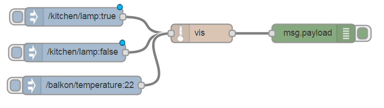
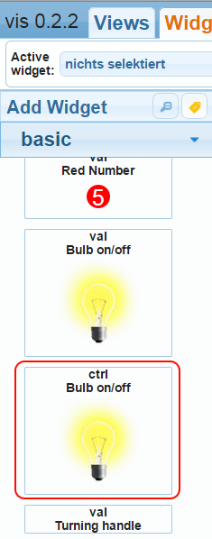
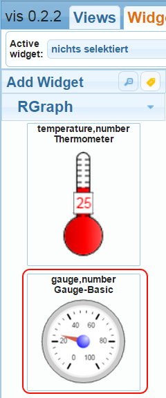
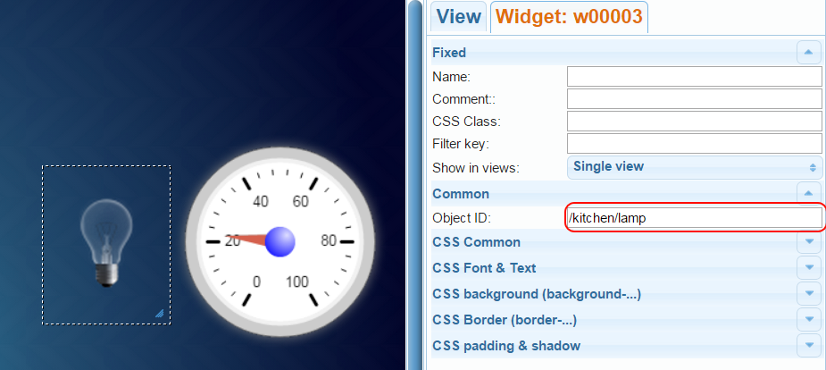
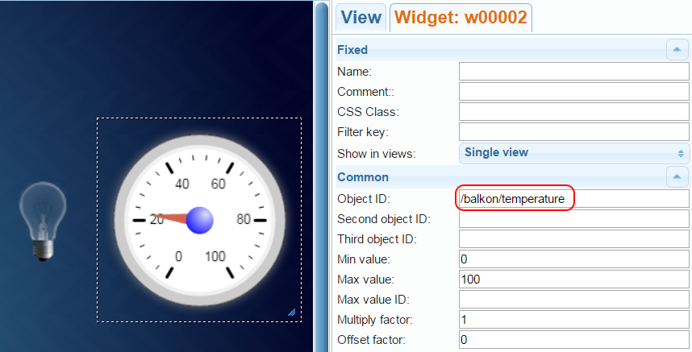
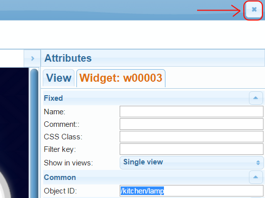
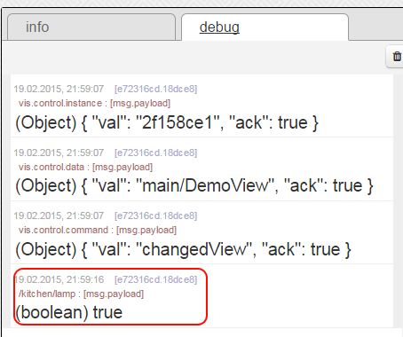
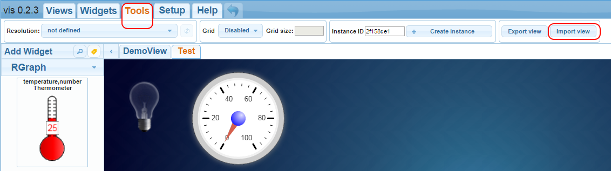
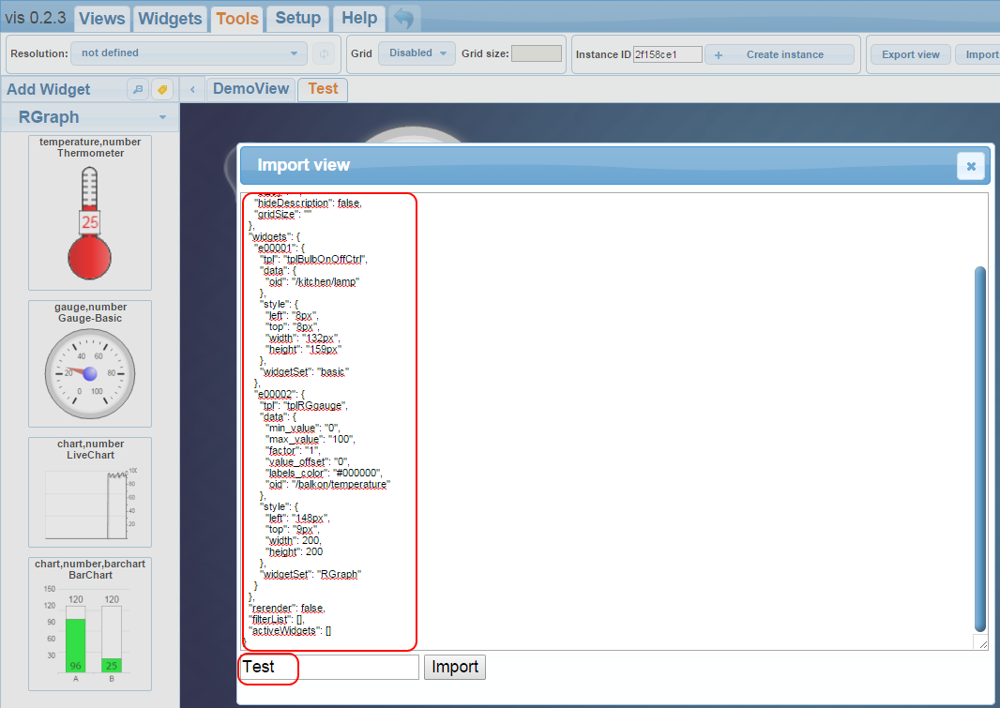

This project adds web visualisation to Node-RED. It is based on [ioBroker.vis](https://github.com/ioBroker/ioBroker.vis).

Functionality
-------------
 We introduce "vis in" node which creates the visualisation server with communication via socket.io.


Install
-------

```bash
cd $NODE_RED_HOME
npm install node-red-vis
```

Usage
--------

Create "advanced => vis in" node and 3 inject nodes as pictured:



Here is code to import:
```[{"id":"a26bad1e.5d945","type":"vis in","language":"en","x":393.09092712402344,"y":81.09089660644531,"z":"4004eda7.bffb14","wires":[["1b331485.e4cceb"]]},{"id":"1d96675d.e26999","type":"inject","name":"","topic":"/kitchen/lamp","payload":"true","payloadType":"string","repeat":"","crontab":"","once":false,"x":184.0908966064453,"y":54.09089660644531,"z":"4004eda7.bffb14","wires":[["a26bad1e.5d945"]]},{"id":"e72316cd.18dce8","type":"debug","name":"","active":true,"console":"false","complete":"false","x":686.0910186767578,"y":80.09089660644531,"z":"4004eda7.bffb14","wires":[]},{"id":"d9c35749.263ca8","type":"inject","name":"","topic":"/kitchen/lamp","payload":"false","payloadType":"string","repeat":"","crontab":"","once":false,"x":185.33331298828125,"y":112.33329772949219,"z":"4004eda7.bffb14","wires":[["a26bad1e.5d945"]]},{"id":"2d3eee9.fd2c112","type":"inject","name":"","topic":"/balkon/temperature","payload":"22","payloadType":"string","repeat":"","crontab":"","once":false,"x":197.20001220703125,"y":166.1999969482422,"z":"4004eda7.bffb14","wires":[["a26bad1e.5d945"]]},{"id":"1b331485.e4cceb","type":"switch","name":"","property":"topic","rules":[{"t":"eq","v":"/kitchen/lamp"},{"t":"eq","v":""}],"checkall":"true","outputs":2,"x":523.2000274658203,"y":81.19999694824219,"z":"4004eda7.bffb14","wires":[["e72316cd.18dce8"],[]]}]```

Deploy it. After deploying go to [http://localhost:1880/vis/edit.html](http://localhost:1880/vis/edit.html) and create "basic - ctrl Bulb on/off":



and "RGraph - Gauge-Basic":



Write into Object ID of "basic - ctrl Bulb on/off" - "/kitchen/lamp":



and into Object ID of "RGraph - Gauge-Basic" - "/balkon/temperature":



Wait for the project saved (about 3 seconds) and after that click here:



You will see something like this:


If you click on lamp following payload will be sent:



You can forward this message to your hardware to control it.

There is a possibility to export project into vis:



Insert following code into dialog edit field:
<pre><code>
{
  "settings": {
    "style": {
      "background_class": "hq-background-blue-marine-lines"
    },
    "theme": "redmond",
    "sizex": "",
    "sizey": "",
    "hideDescription": false,
    "gridSize": ""
  },
  "widgets": {
    "e00001": {
      "tpl": "tplBulbOnOffCtrl",
      "data": {
        "oid": "/kitchen/lamp"
      },
      "style": {
        "left": "8px",
        "top": "8px",
        "width": "132px",
        "height": "159px"
      },
      "widgetSet": "basic"
    },
    "e00002": {
      "tpl": "tplRGgauge",
      "data": {
        "min_value": "0",
        "max_value": "100",
        "factor": "1",
        "value_offset": "0",
        "labels_color": "#000000",
        "oid": "/balkon/temperature"
      },
      "style": {
        "left": "148px",
        "top": "9px",
        "width": 200,
        "height": 200
      },
      "widgetSet": "RGraph"
    }
  },
  "rerender": false,
  "filterList": [],
  "activeWidgets": []
}
</code></pre>




The only issue is **at start** all drawn controls must receive the value.

You can inspire yourself [here](https://iobroker.net:8080). This is a Live-Version of ioBroker.vis!


Change log
--------
### v 0.3.0 (2015-11-02)
* (bluefox) support of latest version of iobroker.vis 


### v 0.2.2 (2015-08-14)
* (bluefox) enable to send "vis.control.command" to vis, like 
```
     {"command": "refresh", "instance": "FFFFFFFF"}
```  
   to refresh the view. Read [here](https://github.com/ioBroker/ioBroker.vis#control-interface) more about commands.
   
* (bluefox) remove jshint warnings.